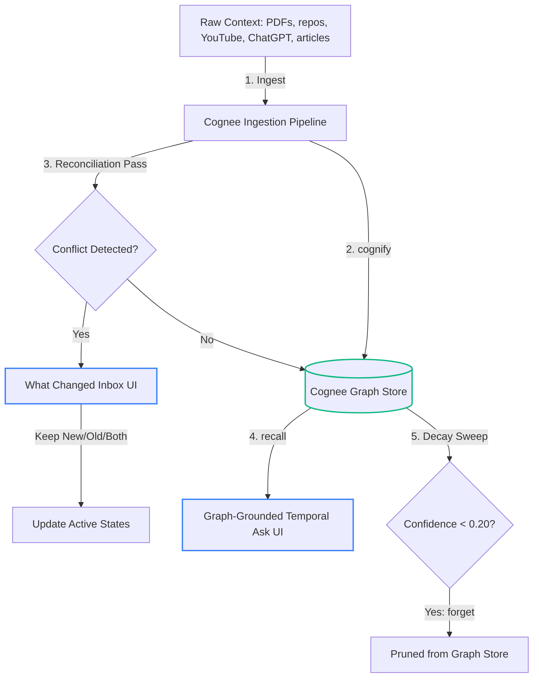

# Synapse: The Autonomous Memory Dashboard

**[Watch the 100-Second Demo Video (Coming Soon)](#)** | **Built by [Nishant Unavane](https://nishantunavane.qzz.io)**

Synapse is a self-organizing memory layers dashboard built on Cognee to handle dynamic context updates, contradiction management, and automatic memory decay.

*AI coding assistants were used in the development of Synapse, in accordance with the WeMakeDevs × Cognee Hackathon guidelines.*

Built for: **The Hangover Part AI: Where is My Context? — WeMakeDevs x Cognee Hackathon (Jun 29 - Jul 5, 2026)**

---

## 1. The Problem & Potential Impact

As Large Language Models (LLMs) ingest more context over time, they encounter a critical issue: **semantic drift and contradiction**. Real-world context is dynamic—credentials get rotated, tech stacks evolve, and architectural design decisions update. Most memory tools simply append new information, leading to conflicting records, bloated contexts, and retrieval failures where the LLM confidently retrieves stale facts.

Synapse solves this by providing a **self-reconciling memory dashboard**. By detecting semantic contradictions at ingestion time and offering an intuitive reconciliation workflow, Synapse ensures the underlying memory store contains only active, verified, and high-confidence facts. The potential impact is huge: eliminating the cost, hallucination, and logic bugs associated with LLMs acting on stale or contradicted knowledge.

---

## 2. Hackathon Submission & Judging Criteria

| Criterion | Where to look |
|---|---|
| **Potential Impact** | [The Problem & Potential Impact](#1-the-problem--potential-impact) — acting on stale/contradicted knowledge is a real, recurring cost this directly addresses |
| **Creativity & Innovation** | [The Reconciliation Engine](#51-the-reconciliation-engine) + "What Changed?" diff query — most memory tools stop at recall; this one decides what still deserves trust |
| **Technical Excellence** | [Core Architecture & Memory Lifecycle](#3-core-architecture-and-memory-lifecycle) + [Cognee API Mapping](#4-cognee-api-mapping) below |
| **Best Use of Cognee** | Full lifecycle usage — `remember`/`recall`/`improve`/`forget` are all load-bearing and core to the product (see API mapping below) |
| **User Experience** | Screenshots of `/resolve`, `/graph`, and `/ask` (provided in the `assets/` folder and accessible via local run) |
| **Presentation Quality** | The WeMakeDevs project submission page + this comprehensive README |

---

## 3. Core Architecture and Memory Lifecycle

The following flow illustrates how Synapse manages the ingestion, contradiction resolution, query recall, and automated decay of dynamic memory:



---

## 4. Cognee API Mapping

Synapse integrates Cognee's memory lifecycle APIs directly to solve the context amnesia problem:

| Cognee Operation | Code Location | Synapse Application Feature |
|---|---|---|
| `remember()` | [services/__init__.py:L391](https://github.com/IamNishant51/Synapse----Ai-/blob/main/backend/services/__init__.py#L391) | Ingests PDF files, GitHub repositories, ChatGPT exports, articles, and YouTube transcripts. |
| `recall()` | [services/__init__.py:L944](https://github.com/IamNishant51/Synapse----Ai-/blob/main/backend/services/__init__.py#L944) | Powers graph-grounded, time-aware chat queries ("what did I believe before vs now"). |
| `improve()` / `cognify()` | [services/__init__.py:L395](https://github.com/IamNishant51/Synapse----Ai-/blob/main/backend/services/__init__.py#L395) (and reconciliation at [L407](https://github.com/IamNishant51/Synapse----Ai-/blob/main/backend/services/__init__.py#L407)) | Runs the `cognify` step to build the graph, and the Reconciliation Pass to detect semantic conflicts and update confidence weights. |
| `forget()` | [services/__init__.py:L1299](https://github.com/IamNishant51/Synapse----Ai-/blob/main/backend/services/__init__.py#L1299) (and [L1311](https://github.com/IamNishant51/Synapse----Ai-/blob/main/backend/services/__init__.py#L1311)) | Enables user-triggered manual pruning, source-level forgetting, and automatic decay of stale nodes. |

---

## 5. Key Features

### 5.1 The Reconciliation Engine
When new evidence is ingested, Synapse queries existing knowledge graph schemas to identify contradictions or superseded statements. Detected conflicts are sent to the user's inbox in the UI. The user can choose to Keep New (pruning the old data), Keep Old (discarding the new claim), or Keep Both (adding the new claim as an alternative relationship).

### 5.2 The Decay Engine
Confidence scores of unreinforced graph nodes degrade over time (by 0.15 per sweep invocation). If a node's confidence score drops below 0.20, Synapse invokes `cognee.forget()` to prune the node from the active graph store.

### 5.3 Temporal Query Diffs
Queries matching historical comparison patterns (e.g. "what changed since March?") extract diff matrices outlining added nodes, deleted nodes, changed schemas, and newly recorded decisions.

---

## 6. Known Limitations

- **Authentication Model**: The security implementation relies on a Tier 1 shared-secret gateway rather than a full multi-tenant user authentication system, which is optimized for local testing and submission reviews.
- **Chat History Persistence**: The chat conversation history in `/ask` is currently persisted in the browser's local storage (`localStorage`) rather than being stored on the server side.
- **Database Scope**: The backend metadata is stored in a local SQLite database file, and the Cognee dataset configuration is configured for a single-user demo environment rather than multi-tenant enterprise scale.

---

## 7. Technical Stack
- **Frontend**: Next.js 15 (App Router), Tailwind CSS, TypeScript, `react-force-graph-3d` for the node network.
- **Backend**: FastAPI (Python), SQLite metadata database ([database.py](https://github.com/IamNishant51/Synapse----Ai-/blob/main/backend/database.py)), Cognee SDK, Gemini / Groq API wrappers.

---

## 8. Local Setup

### Backend Setup
1. Navigate to the backend directory:
   ```bash
   cd backend
   ```
2. Create and activate a virtual environment:
   ```bash
   python -m venv venv
   source venv/bin/activate
   ```
3. Install dependencies:
   ```bash
   pip install -r requirements.txt
   ```
4. Set the environment variables in a `.env` file:
   ```env
   LLM_PROVIDER=gemini
   LLM_MODEL=gemini/gemini-2.5-flash
   GEMINI_API_KEY=your_gemini_key
   GROQ_API_KEY=your_groq_fallback_key
   ```
5. Start the backend server:
   ```bash
   python -m uvicorn main:app --reload --port 8000
   ```

### Frontend Setup
1. Navigate to the frontend directory:
   ```bash
   cd ../frontend
   ```
2. Install dependencies:
   ```bash
   npm install
   ```
3. Start the local development server:
   ```bash
   npm run dev
   ```
4. Open [http://localhost:3000](http://localhost:3000) in your browser.

---

## Author

Built by [Nishant Unavane](https://nishantunavane.qzz.io) for the WeMakeDevs × Cognee Hackathon.
