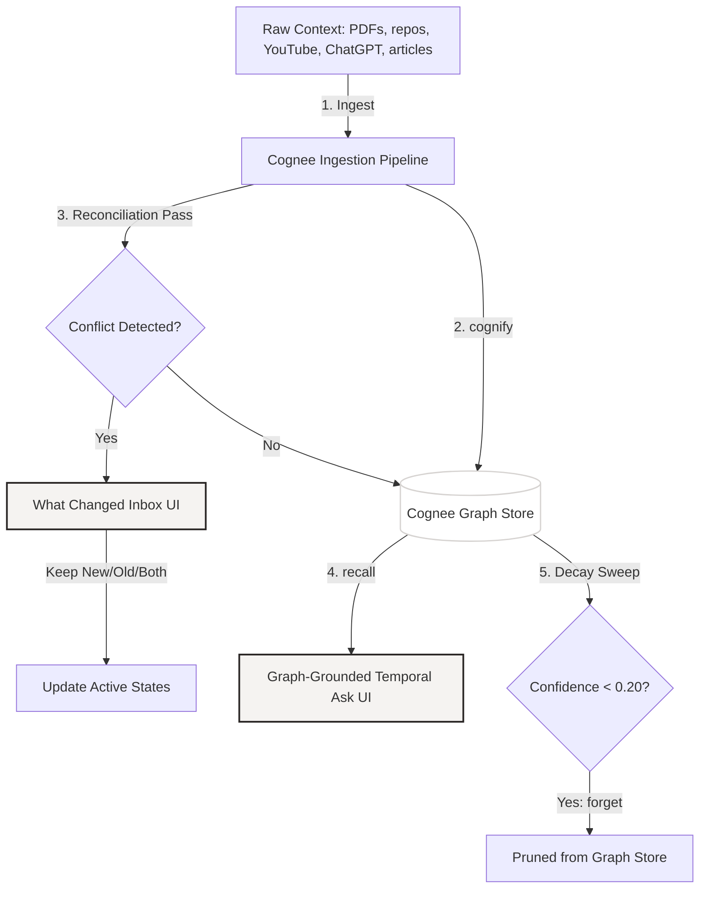

# Synapse: The Autonomous Memory Dashboard

[Watch the 100-Second Demo Video](https://github.com/IamNishant51/Synapse----Ai-/blob/main/README.md)

Synapse is a self-organizing memory layers dashboard built on Cognee to handle dynamic context updates, contradiction management, and automatic memory decay.

Built for: The Hangover Part AI: Where is My Context? — WeMakeDevs x Cognee Hackathon (Jun 29 - Jul 5, 2026)

---

## 1. Core Architecture and Memory Lifecycle

The following flow illustrates how Synapse manages the ingestion, contradiction resolution, query recall, and automated decay of dynamic memory:



---

## 2. Cognee API Mapping

Synapse integrates Cognee's memory lifecycle APIs directly to solve the context amnesia problem:

| Cognee Operation | Code Location | Synapse Application Feature |
|---|---|---|
| `remember()` | [services/__init__.py:L388](https://github.com/IamNishant51/Synapse----Ai-/blob/main/backend/services/__init__.py#L388) | Ingests PDF files, GitHub repositories, ChatGPT exports, articles, and YouTube transcripts. |
| `recall()` | [services/__init__.py:L913](https://github.com/IamNishant51/Synapse----Ai-/blob/main/backend/services/__init__.py#L913) | Powers graph-grounded, time-aware chat queries ("what did I believe before vs now"). |
| `improve()` / `cognify()` | [services/__init__.py:L462](https://github.com/IamNishant51/Synapse----Ai-/blob/main/backend/services/__init__.py#L462) | Runs the Reconciliation Pass after ingestion to detect semantic conflicts and updates confidence weights. |
| `forget()` | [services/__init__.py:L1197](https://github.com/IamNishant51/Synapse----Ai-/blob/main/backend/services/__init__.py#L1197) | Enables user-triggered manual pruning, source-level forgetting, and automatic decay of stale nodes. |

---

## 3. Key Features

### 3.1 The Reconciliation Engine
When new evidence is ingested, Synapse queries existing knowledge graph schemas to identify contradictions or superseded statements. Detected conflicts are sent to the user's inbox in the UI. The user can choose to Keep New (pruning the old data), Keep Old (discarding the new claim), or Keep Both (adding the new claim as an alternative relationship).

### 3.2 The Decay Engine
Confidence scores of unreinforced graph nodes degrade over time (by 0.15 per sweep invocation). If a node's confidence score drops below 0.20, Synapse invokes `cognee.forget()` to prune the node from the active graph store.

### 3.3 Temporal Query Diffs
Queries matching historical comparison patterns (e.g. "what changed since March?") extract diff matrices outlining added nodes, deleted nodes, changed schemas, and newly recorded decisions.

---

## 4. Technical Stack
- **Frontend**: Next.js 15 (App Router), Tailwind CSS, TypeScript, `react-force-graph-3d` for the node network.
- **Backend**: FastAPI (Python), SQLite metadata database ([database.py](https://github.com/IamNishant51/Synapse----Ai-/blob/main/backend/database.py)), Cognee SDK, Gemini / Groq API wrappers.

---

## 5. Local Setup

### Backend Installation
1. Navigate to the backend directory:
   ```bash
   cd backend
   ```
2. Create and activate a virtual environment:
   ```bash
   python -m venv venv
   source venv/bin/activate
   ```
3. Install dependencies:
   ```bash
   pip install -r requirements.txt
   ```
4. Set the environment variables in a `.env` file:
   ```env
   LLM_PROVIDER=gemini
   LLM_MODEL=gemini/gemini-2.5-flash
   GEMINI_API_KEY=your_gemini_key
   GROQ_API_KEY=your_groq_fallback_key
   ```
5. Start the backend server:
   ```bash
   python -m uvicorn main:app --reload --port 8000
   ```

### Frontend Installation
1. Navigate to the frontend directory:
   ```bash
   cd ../frontend
   ```
2. Install dependencies:
   ```bash
   npm install
   ```
3. Start the local development server:
   ```bash
   npm run dev
   ```
4. Open [http://localhost:3000](http://localhost:3000) in your browser.
